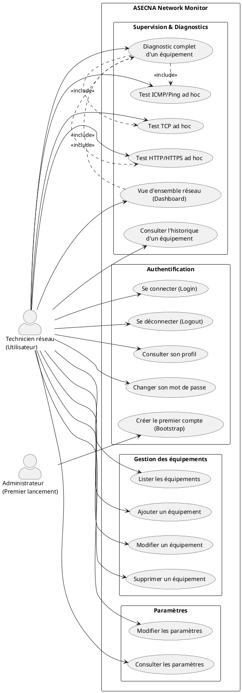
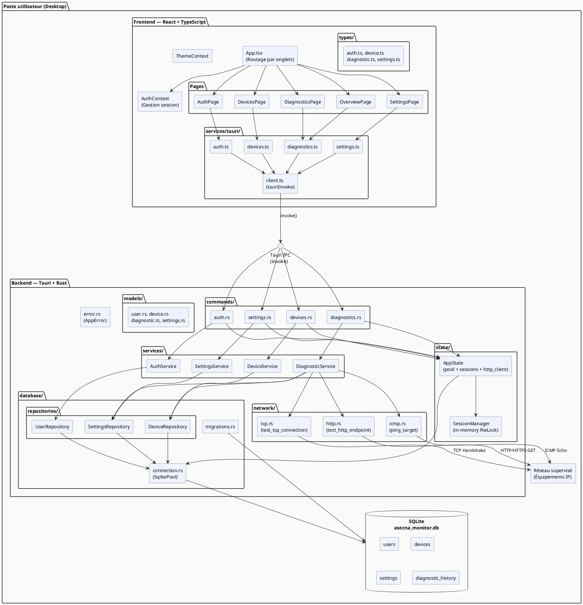
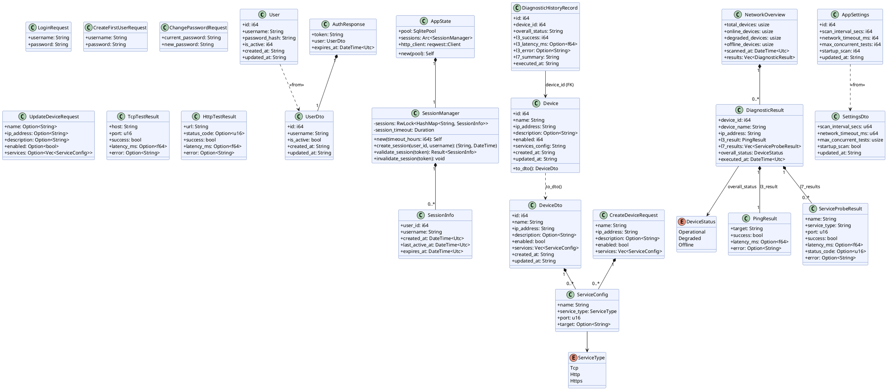
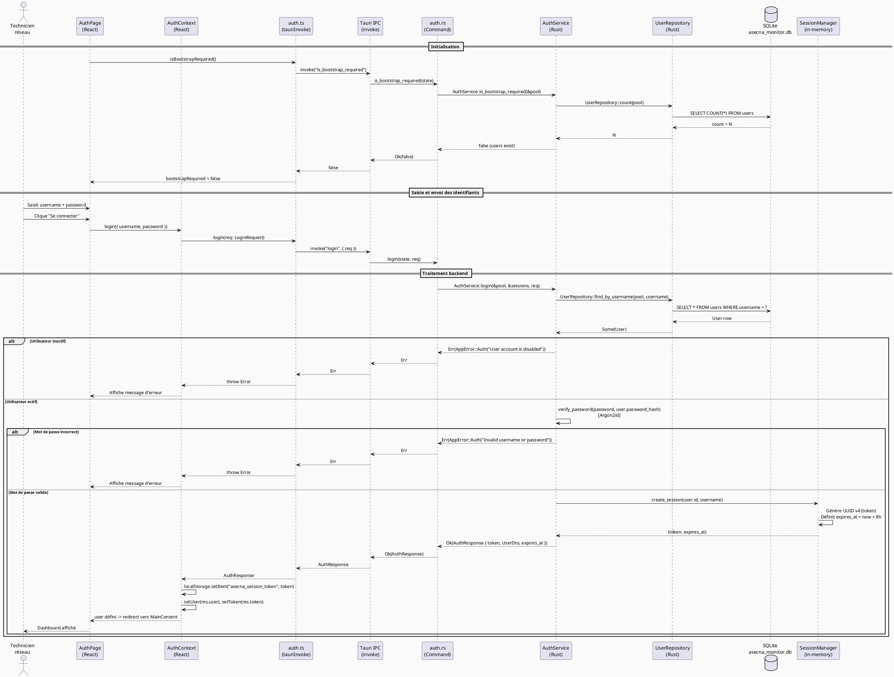
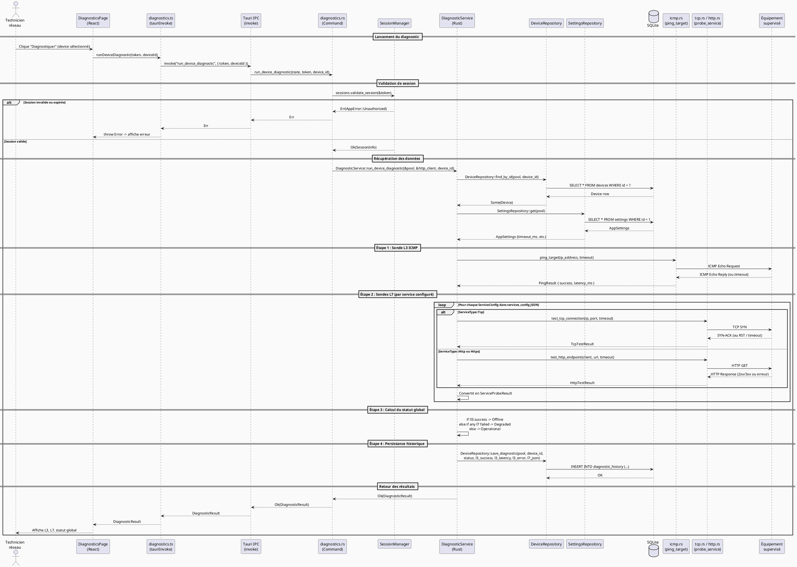
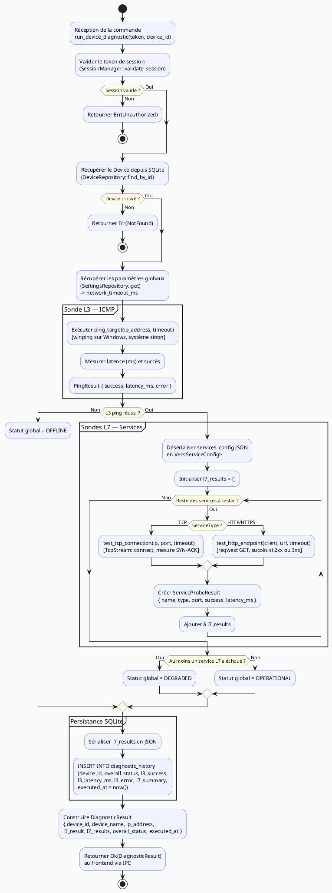
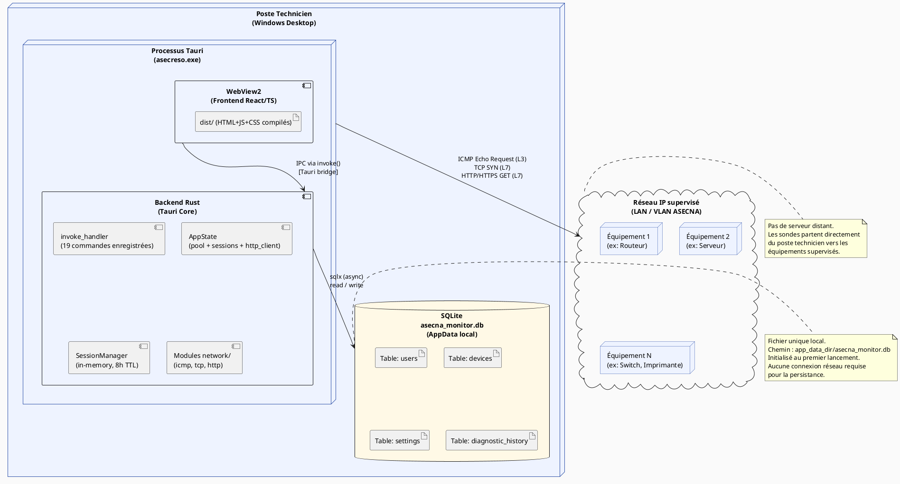

# Diagrammes UML — ASECNA Network Monitor

> Diagrammes générés à partir du code source réel du projet (MVP).
> Application desktop de supervision réseau basée sur **Tauri 2 + Rust** (backend) et **React + TypeScript** (frontend), avec persistance **SQLite**.

---

## 1. Diagramme de cas d'utilisation

### Objectif
Représenter les acteurs et les fonctionnalités réellement exposées par l'application au travers des commandes Tauri enregistrées dans `lib.rs`.

### PlantUML

### Description
- **Admin** est l'acteur du premier lancement uniquement : il crée le compte initial via `create_first_user` quand la base SQLite est vide (`is_bootstrap_required`).
- **Technicien réseau** accède à toutes les fonctionnalités après authentification.
- Le diagnostic complet (`run_device_diagnostic`) inclut systématiquement un ping ICMP (L3) et des sondes de services L7 (TCP/HTTP/HTTPS).
- La vue d'ensemble (`get_network_overview`) lance des diagnostics concurrents sur tous les équipements activés.

---

## 2. Diagramme de composants / architecture

### Objectif
Représenter la décomposition modulaire réelle de l'application : couche React, pont Tauri IPC, modules Rust (commands, services, repositories, network, state), et SQLite.

### PlantUML

### Description
- `client.ts` est le point d'entrée unique de toute communication frontend → backend via `invoke()`.
- `AppState` est injecté dans chaque commande par Tauri via `State<'_, AppState>` ; il regroupe le pool SQLite, le `SessionManager` en mémoire, et le client HTTP `reqwest`.
- Les repositories accèdent directement au pool SQLite via `sqlx`.
- Le module `network/` effectue de vraies sondes réseau : `winping` (Windows IcmpSendEcho) pour ICMP, `TcpStream::connect` pour TCP, `reqwest` pour HTTP/HTTPS.

---

## 3. Diagramme de classes

### Objectif
Représenter les structures/types réellement définis dans les modules `models/` et `state/` du backend Rust, ainsi que leurs relations.

### PlantUML

### Description
- `User` (entité SQLite) et `UserDto` (DTO envoyé au frontend) sont explicitement séparés — `password_hash` n'est jamais sérialisé.
- `Device.services_config` est stocké en JSON dans SQLite et désérialisé en `Vec<ServiceConfig>` lors de la conversion `to_dto()`.
- `AppState` est l'état global partagé par toutes les commandes Tauri via `State<'_, AppState>`.
- `SessionManager` utilise un `RwLock<HashMap>` en mémoire : les sessions ne survivent pas à un redémarrage.
- `DiagnosticResult` agrège le résultat L3 (`PingResult`) et les résultats L7 (`Vec<ServiceProbeResult>`).

---

## 4. Diagramme de séquence — Authentification (Login)

### Objectif
Tracer le chemin réel du login depuis le formulaire React jusqu'à la création de session en mémoire Rust, en passant par Argon2id.

### PlantUML

### Description
- La vérification de bootstrap est effectuée **à chaque démarrage** : si la table `users` est vide, le formulaire de création du premier compte s'affiche.
- La vérification du mot de passe est réalisée par **Argon2id** (`AuthService::verify_password`), sans jamais transmettre le hash au frontend.
- Le token de session est un **UUID v4** stocké en `localStorage` côté React et dans un `HashMap<String, SessionInfo>` en mémoire Rust (non persisté en SQLite).
- La durée de session est de **8 heures** (définie dans `AppState::new`).

---

## 5. Diagramme de séquence — Diagnostic complet d'un équipement

### Objectif
Tracer le flux réel de `run_device_diagnostic` : du clic utilisateur jusqu'à la persistance en SQLite et le retour des résultats.

### PlantUML

### Description
- La validation de session est obligatoire : `state.sessions.validate_session(&token)` est appelée **avant** toute opération métier dans les commandes protégées.
- Le ping ICMP utilise `winping` (Windows IcmpSendEcho, sans droits admin) sur Windows, ou `ping -c 1` système sur Linux/macOS.
- Les services L7 sont lus depuis la colonne `services_config` (JSON) de la table `devices` et désérialisés dynamiquement.
- Le résultat complet est persisté en base (`diagnostic_history`) **avant** d'être retourné au frontend.

---

## 6. Diagramme d'activité — Processus de diagnostic

### Objectif
Représenter les étapes, branches et conditions du diagnostic réseau d'un équipement (logique de `execute_diagnostic_internal`).

### PlantUML

### Description
- La logique de statut est **strictement hiérarchique** : L3 prime sur L7. Si le ping échoue, le statut est `Offline` sans exécuter les sondes L7.
- Si L3 passe mais qu'au moins un service L7 échoue, le statut est `Degraded` (équipement partiellement disponible).
- `Operational` signifie que le ping ET tous les services L7 configurés répondent correctement.
- La persistance en base se fait toujours, qu'il y ait des services L7 ou non.

---

## 7. Diagramme de déploiement

### Objectif
Représenter l'environnement de déploiement réel : poste utilisateur unique, processus Tauri (frontend WebView + backend Rust), fichier SQLite local, et les équipements réseau supervisés.

### PlantUML

### Description
- L'application est **entièrement locale** : un seul poste, un seul processus, un seul fichier SQLite dans le répertoire `AppData` de l'utilisateur.
- Il n'y a **pas de serveur backend distant** : Tauri embarque le backend Rust dans le même exécutable que le frontend WebView2.
- Les sondes réseau (ICMP, TCP, HTTP) partent **directement** du poste technicien vers les équipements IP du réseau supervisé.
- `SessionManager` est en mémoire uniquement : les sessions ne survivent pas à un redémarrage de l'application.

---

## Références — Fichiers sources utilisés

| Diagramme | Fichiers sources principaux |
|-----------|----------------------------|
| 1. Cas d'utilisation | `src-tauri/src/lib.rs` (liste des 19 commandes `invoke_handler`) |
| 2. Composants / Architecture | `src/App.tsx`, `src/context/AuthContext.tsx`, `src/services/tauri/client.ts`, `src-tauri/src/lib.rs`, `src-tauri/src/state/app_state.rs`, `src-tauri/src/commands/mod.rs`, `src-tauri/src/network/mod.rs` |
| 3. Diagramme de classes | `src-tauri/src/models/user.rs`, `src-tauri/src/models/device.rs`, `src-tauri/src/models/diagnostic.rs`, `src-tauri/src/models/settings.rs`, `src-tauri/src/state/app_state.rs`, `src/types/device.ts`, `src/types/diagnostic.ts` |
| 4. Séquence — Authentification | `src/context/AuthContext.tsx`, `src/services/tauri/auth.ts`, `src-tauri/src/commands/auth.rs`, `src-tauri/src/services/auth_service.rs`, `src-tauri/src/database/repositories/user_repository.rs`, `src-tauri/src/state/app_state.rs` |
| 5. Séquence — Diagnostic | `src/services/tauri/diagnostics.ts`, `src-tauri/src/commands/diagnostics.rs`, `src-tauri/src/services/diagnostic_service.rs`, `src-tauri/src/network/icmp.rs`, `src-tauri/src/network/tcp.rs`, `src-tauri/src/network/http.rs`, `src-tauri/src/database/repositories/device_repository.rs` |
| 6. Activité — Diagnostic | `src-tauri/src/services/diagnostic_service.rs` (méthode `execute_diagnostic_internal`, logique de statut L3/L7) |
| 7. Déploiement | `src-tauri/src/lib.rs`, `src-tauri/src/state/app_state.rs`, `src-tauri/src/database/connection.rs`, `src-tauri/src/database/migrations.rs`, `src-tauri/tauri.conf.json` |
